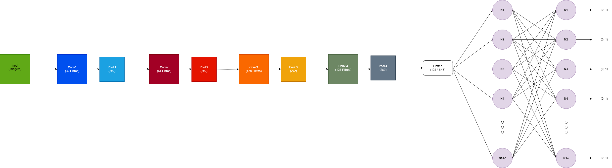

# CNN para Reconhecimento de Vegetais

Este projeto implementa uma rede neural convolucional (CNN) em PyTorch para o reconhecimento de imagens de vegetais. 
O objetivo é classificar corretamente diferentes tipos de vegetais com base em um conjunto de imagens de treinamento.
Com esse CNN é possível reconhecer 13 tipos de vegetais diferentes, considerando seu nome em inglês:
* Apple
* Banana
* Carrot
* Corn
* Cucumber
* GingerRoot
* Limes
* Onion
* Pepper
* Pineapple
* Potato
* Strawberry
* Tomato

### Datasets disponíveis em : 
https://www.kaggle.com/datasets/moltean/fruits por Mihai Oltean, Fruits-360 dataset, 2017-

## Estrutura do Projeto

O projeto possui os seguintes arquivos e diretórios principais:

- `src/data_preprocessing.py`: Script responsável pelo pré-processamento dos dados, incluindo redimensionamento, normalização e criação de geradores de dados para treinamento e teste.
- `src/model.py`: Define a arquitetura da CNN para reconhecimento de vegetais.
- `src/train.py`: Contém a função de treinamento da CNN, além de salvar o modelo treinado.
- `src/predict.py`: Realiza a previsão com base em uma imagem de teste, exibindo a classe e a probabilidade correspondente.
- `main.py`: Script principal que chama as funções de pré-processamento, cria e treina o modelo e carrega o modelo treinado para avaliar o desempenho em novos dados de teste.

## Arquitetura da Rede Neural

A CNN utilizada para o reconhecimento de vegetais possui a seguinte estrutura:



1. **Entrada**:
   - Dimensão de entrada: Imagens de 100x100 pixels, com 3 canais de cor (RGB).
   
2. **Camadas Convolucionais**:
   - Primeira camada convolucional (`conv1`): Convolução com 32 filtros de tamanho 3x3 e padding de 1.
   - Segunda camada convolucional (`conv2`): Convolução com 64 filtros de tamanho 3x3 e padding de 1.
   - Terceira camada convolucional (`conv3`): Convolução com 128 filtros de tamanho 3x3 e padding de 1.
   - Quarta camada convolucional (`conv4`): Convolução com 128 filtros de tamanho 3x3 e padding de 1.
   
3. **Funções de Ativação e Pooling**:
   - Função de ativação **ReLU** (Rectified Linear Unit) é usada após cada camada convolucional.
   - Pooling **Max Pooling** com kernel de 2x2 é aplicado após cada camada convolucional.

4. **Camadas Totalmente Conectadas (Fully Connected)**:
   - Primeira camada densa (`fc1`): 512 neurônios.
   - Camada de saída (`fc2`): 13 neurônios, cada um representando uma classe de vegetais.

5. **Camada de Saída**:
   - A camada de saída possui uma ativação **softmax** para calcular as probabilidades de cada classe.

## Funções Utilizadas

- **Função de perda**: `CrossEntropyLoss`, utilizada para calcular o erro durante o treinamento.
- **Otimização**: `Adam` com taxa de aprendizado inicial de 0.005, ajustada por um scheduler `StepLR` que diminui a taxa a cada 10 épocas.
- **Dispositivo**: A CNN é treinada utilizando a GPU, caso esteja disponível.

## Instalação

Siga os passos abaixos para instalar e configurar o projeto:

### Requisitos

Antes de instalar, certifique-se de ter os seguintes pré-requisitos:

- Python 3.12
- pip (gerenciador de pacotes do Python)

### Passos de Instalação

1. Abra a pasta do projeto.
2. Crie um ambiente virtual(opcional, mas recomendado):
```bash
python -m venv venv 
```
3. Ative o ambiente virtual:
* No Windows:
```bash
venv\Scripts\activate
```
* No Linux\macOS:
```bash
source venv\bin\activate
```
4. Instale as dependências:
```bash
pip install -r requirements.txt
```

## Execução do Projeto

* Para treinamento do modelo:
```bash
python main.py
```
* Para previsão com modelo já treinado:
```bash
python predict.py
```
os vegetais com uma probabilidade associada.

## Exemplo de Uso

Para prever a classe de um vegetal em uma imagem nova, altere o segundo parâmetro para o caminho da imagem na linha: 
```bash
class_name, probability = predict_image(model, '../data/data_to_predict/tomato1.jpg')
```

Em seguida, execute o script `predict.py`:

```bash
python predict.py
```
## Considerações sobre a execução:

1. O modelo treinado é armazenado em **models**, o modelo já treinado está com o nome **trained_model.pth**.
2. O resultado é retornado via console.
3. No caso do treinamento é possível alterar a topologia da rede e seus parâmetros
    * Em **model/model_trainer.py** é possível alterar a entrada de ModelSettings para determinar o initial_learning_rate, epochs e patience.
    * Em **model/settings.py** é possível alterar a topologia da rede em **get_layers_config**